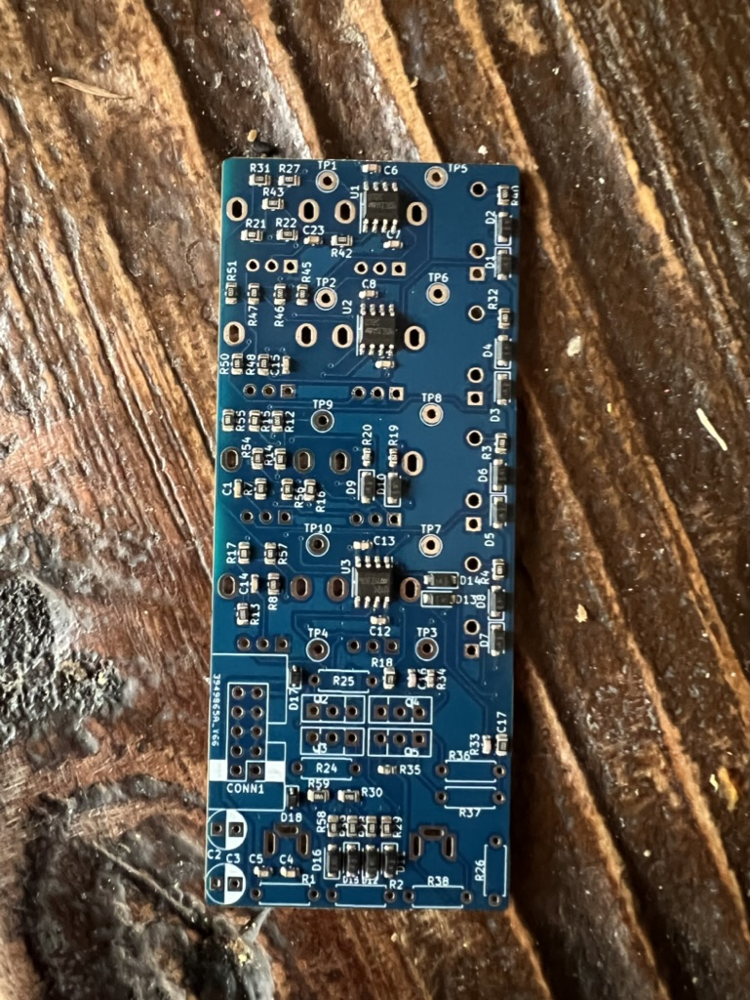
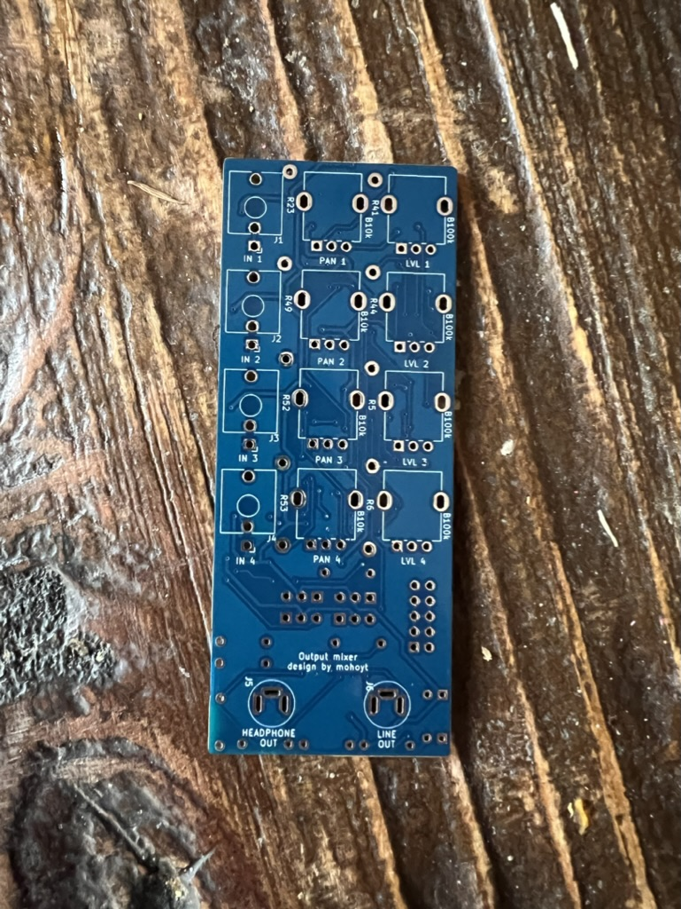

# Output mixer for Eurorack

Inspired by the mixer in the Erica Synths x mki.edu line (but with added channels and SMD components)

## Features
- 4 inputs with pan (L-R) and level adjustable
- 2 outputs, line out and headphone out
- Mostly SMD with a couple through hole parts

## Issues
- [x] Pan is reversed
- [x] Not enough space for 1W 47R resistor
- [x] BD139/140 overheating

All addressed in current version (v1.1). The overheating was a result of poor quality BD139 and BD140 that I had sourced. 

